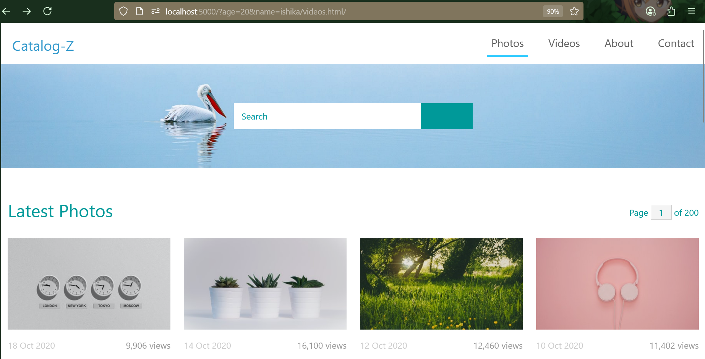

# 🌐 Template Website with Node.js, Express.js, and EJS

This project is a basic template website built using **Node.js**, **Express.js**, and **EJS** for rendering dynamic content. Static assets like HTML, CSS, images, and JS are served using Express's static middleware.

---

## 🚀 Features

- Express.js for server-side routing
- EJS for dynamic view rendering
- Static HTML/CSS/JS served from `HTML-P` folder
- Middleware to check user query (age & name)
- Organized project structure

---
## 📦 Tech Stack

- **Node.js**
- **Express.js**
- **EJS**
- **HTML & CSS**

---
1. **Install dependencies** (if any):
   ```bash
   npm install
   
2. **Start the server:**
   ```node express.js```

3. **Visit in browser:**
   ```http://localhost:5000/?age=20&name=ishika```
   
---

## Website Demo:


---

# 📸 Template Website Note

> **Note:**  
> Only the **Photos** page will run. The **Video**, **About**, and **Contact** pages are **not defined**. These are just included as examples.

---

## Template Details

- **Template Source**: TemplateMo (templatemo.com) :contentReference[oaicite:1]{index=1}  
- **License**: 100% Free to download and use — personal or commercial use allowed without restriction :contentReference[oaicite:2]{index=2}  
- **Template Count**: Website par 580–590+ free HTML/CSS templates available, including more than 140 responsive Bootstrap themes :contentReference[oaicite:3]{index=3}  
- **Popular Template Demo (Example)**: “Powerful” – free responsive Bootstrap template published February 2014 :contentReference[oaicite:4]{index=4}

---

## Usage Instructions

1. Template download karein from [TemplateMo](https://templatemo.com).
2. ZIP file extract karein aur project folder mein copy karein.
3. Template ke HTML/CSS/JS files ko customize karein:
   - CSS mein branding, colors, fonts adjust karein
   - HTML content update karein
   - Required JavaScript modules ya animations implement karein

---
